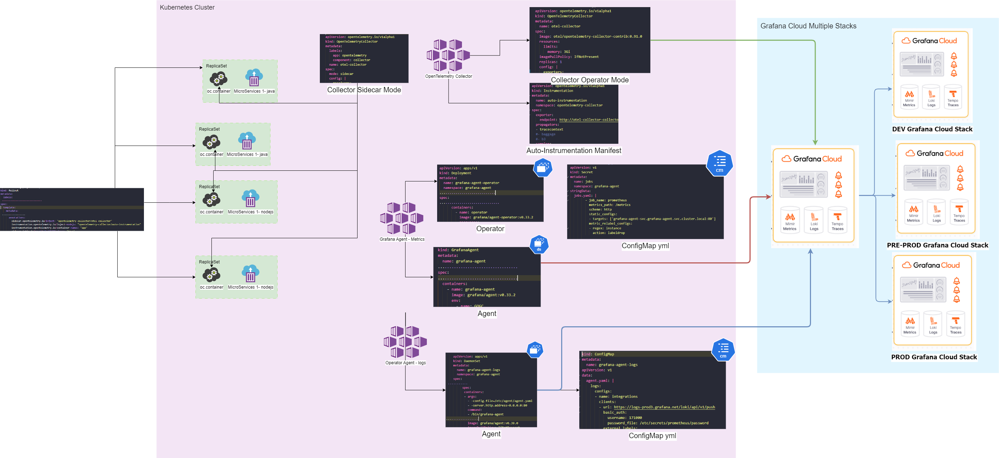

# ARQUITECTURA DE LA SITUACION ACTUAL DEL LABORATORIO CONFECCIONADO


el siguiente diagrama representa la situacion actual que inicio el laboratorio para entender como esta concebido el trabajo actual de la Observabilidad para el usuario .

Esta arquitectura invita a entender temas como:

 - configuraciones aisladas para tener metricas / logs / trazas
 - formas de configuracion no homogeneas
 - exclusivada de utilizar del Stack  LGTM 

### Ventajas
````
- Escalado sencillo mediante agrupación o fragmentación hashmod
- Minimiza el efecto “vecino ruidoso”
- Fácil de meta-monitorear
````

### Contras
````
- Requiere ejecutarse en una infraestructura separada
````
### Usar para
````
- Colección de telemetría escalable
````

# ESTRUCTURACION DE COMPONENTES 

## Grafana Agente / Operador 

 - Esta componente que esta configurado solo para soportar la captura de metricas de :
   -  infraestructura  del cluster
   -  Service Mesh

## Grafa Agente Loki
 - Este componente esta concevido para extraer los logs que los container generan y asi enviarlo a la instancia cloud de grafana

## Open Telemetry

 - Este componente esta preparandose para soportar :
   - la recoleccion tanto de trazas como span de los artefactos en modo auto-instrumentado
   - las metricas para activar las vistas graficas de las trazas ( Services Graph)





# PASOS PARA LEVANTA GRAFANA EN MODO STATIC

## PREPARACION CLUSTER

 ## OPCION CLUSTER PUBLICO
 ````
  - make create-cluster-simple 
  -  gcloud container clusters get-credentials autopilot-cluster-app --zone=us-central1-a --project sparta-proyect-host 
 ````

 ## OPCION CLUSTER PRIVADO

 ````
  - make create-cluster-simple-privated  
  - gcloud container clusters get-credentials autopilot-cluster-app --zone=us-central1-a --project sparta-proyect-host 
  - gcloud container clusters update autopilot-cluster-app --enable-master-authorized-networks  --master-authorized-networks 190.215.171.124/32
  - gcloud container clusters get-credentials autopilot-cluster-app --project=sparta-proyect-host --zone=us-central1-a   --internal-ip
````

## ESPACIOS  DE NOMBRES
````
 - kubectl apply -f .\minifiest\cluster\00-namespace.yaml
````

## COLLECTOR EN MODO OPERADOR PARA LA AUTO-ISTRUMENTACION
````
 - kubectl apply  -f https://github.com/cert-manager/cert-manager/releases/download/v1.14.4/cert-manager.yaml
 - kubectl apply -f https://github.com/open-telemetry/opentelemetry-operator/releases/latest/download/opentelemetry-operator.yaml
````
###  OPCION 1
````
  - kubectl apply -f .\minifiest\otel\1.2otel-config-auto.yaml
````
###  OPCION 2
````
  - kubectl apply -f .\minifiest\otel\1.1otel-config-auto.yaml
````

## MODOS INSTALACION MICROSERVICIOS  AUTO-INSTRUMENACION 
````
  - Opcion 1 : kubectl apply -f .\minifiest\deployment-apps-auto.yml 
  - Opcion 2 : kubectl apply -f .\minifiest\replicaset-apps-auto.yml
````